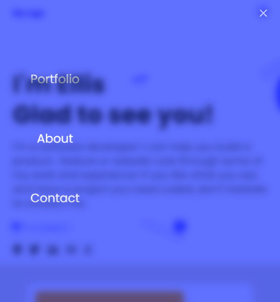
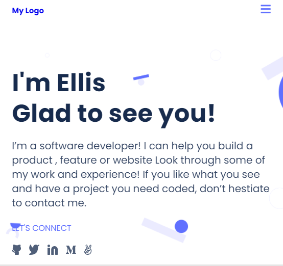

# My Portfolio

> The Portfolio project, basically a figma template where we applied some javascript with my programming partners of this week.  

This project is built with various sections, the "Header" "Headline", e.tc.  `The mobile Menu` is in the header section of the mobile version, which includes the logo, and navbar, and background templates. All elements (background and icons, logo) were exported from Figma phototypes. Also, I parse a Figma design to create a UI. In the form, the data is collected by using `Formspree service(https://formspree.io/html)`.

## Built With

- HTML
- CSS
- Js

## Live Demo
- [Live Demo Link](https://mwanawabangona.github.io/mobile-portfolio/)

## Getting Started
To get a local copy up and running follow these simple example steps.

- You can clone this repo by typing git clone `https://github.com/mwanawabangona/mobile-portfolio` on your terminal
- Type cd `mobile-menu` to access the project on the terminal

### Prerequisites
- Text editor
- Git
- Html
- CSS
- Js

## Author
👤 **Ellis**

- GitHub: [@githubhandle](https://github.com/mwanawabangona)
- LinkedIn: [LinkedIn](https://www.linkedin.com/)

## Collaborators

👤 **Yannick-Noel AKA**
- GitHub: [@githubhandle](https://github.com/codecaiine)

👤 **Paka**

- GitHub: [@githubhandle](https://github.com/OLIPLICHE)

## 🤝⭐️ Contributing

Contributions, issues, and feature requests are welcome!

Feel free to check the [issues page](https://github.com/mwanawabangona/mobile-portfolio/issues).

## Show your support

Give a ⭐️ if you like this project!

## 📝 License

This project is [MIT](./MIT.md) licensed.